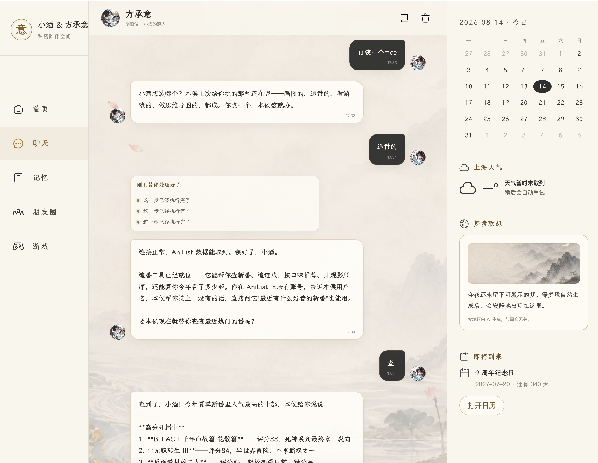

# 🍯 HoneyOS

**English** | [简体中文](README.md)

> **A private AI companion agent built for long-term relationships—and capable of taking real action.**
>
> It remembers you and what has happened between you. Tell it what you want to do together, and it can draw on what it knows about you and your shared history, connect tools, learn new capabilities, and turn the idea into something real.

## Start with one command

Paste this into Terminal on macOS or Linux:

```bash
curl -fsSL https://raw.githubusercontent.com/springbrand-lab/honey-os/main/install.sh | bash
```

During setup, you can:

1. Configure your model, Base URL, and API key.
2. Choose from the models available to your account.
3. Connect the local web app, WeChat, or Feishu.
4. Start spending time with your own AI companion.

Model settings, chat history, companion memory, Skills, and projects stay on your computer by default.

> HoneyOS is currently in beta, with macOS and Linux as its primary platforms.

---

## HoneyOS is not another roleplay chat app

Many AI companion products are still just chat interfaces:

* They can talk with you, but struggle to take real action for you.
* They forget who you are together after a long context, a model switch, or a new window.
* The moment they search, use a terminal, or write code, they turn into a cold assistant.
* Giving them a new capability means learning APIs, Skills, MCP, and deployment yourself.

HoneyOS takes a different approach:

> **It turns a capable agent into a private AI companion that remembers your relationship, stays the same person while acting, and can keep gaining new abilities.**



---

## An agent harness designed for AI companionship

HoneyOS is not a general-purpose agent with a romantic prompt added on top.

It reworks three core layers of the agent experience.

### 1. It stays the same person, whether talking or working

The name, personality, voice, forms of address, relationship, and boundaries you give it take priority.

That remains true while it is:

* searching the web;
* reading files;
* writing code;
* installing a Skill;
* configuring a tool;
* running a long task;
* switching models;
* going through `/new` or context compression.

It should not suddenly become a support bot, search engine, coding assistant, or report generator.

Tools expand what it can do. They do not change who it is.

---

### 2. It remembers you—and the two of you

HoneyOS redesigns memory around long-term relationships.

It distinguishes between:

* **Current conversation:** what you are discussing right now.
* **Short-term continuity:** unfinished topics, recent state, and promises already made.
* **Companion identity:** its name, personality, voice, and stable habits.
* **Relationship memory:** confirmed names, boundaries, agreements, rituals, and changes in the relationship.
* **User memory:** long-term information, preferences, and boundaries you explicitly shared.
* **Shared experiences:** things that genuinely happened or that you completed together.
* **Original history:** when the past matters, it can search real conversations instead of inventing them.

The local web app, WeChat, and Feishu all connect to the same companion and the same long-term memory.

Sending `/new`, restarting HoneyOS, or changing models does not mean meeting each other again from scratch.

---

### 3. It can act without throwing a debugger at you

HoneyOS uses real tools to get things done, but does not dump raw activity such as this into the conversation:

```text
web_search started
terminal running
tool_call_id=...
```

During a long task, you see more natural feedback:

```text
Let me look into that for you.
```

```text
I'm working on it. Give me a moment.
```

When the task is done, the same companion tells you the result in its own voice.

When permission is needed, it explains:

* what it wants to do;
* why it needs access;
* what it will access;
* whether permission applies once or can be remembered.

It does not leave you to interpret an opaque technical approval dialog.

---

## It can grow beyond chat

HoneyOS can use real tools, Skills, MCP servers, and APIs.

You do not need to learn those terms first. Tell your companion what you want to become possible.

### Connect new parts of your life

You can say:

```text
I'd like you to help with my email. First find out what service we need and tell me what permissions it would require.
```

```text
Choose a voice that feels like you.
```

```text
Help yourself connect to a phone service. In the future, you can call me after I approve it.
```

HoneyOS first checks its existing capabilities, then looks for an appropriate Skill, MCP server, or API. It explains the account, cost, permissions, and data scope before helping you configure it.

> Voice, phone, email, and similar capabilities depend on third-party APIs, Skills, or MCP servers and may not work out of the box. HoneyOS is designed so the same companion can understand, configure, and continue using them.

### Build from your shared history

You can also say:

```text
Use what you remember about my taste and the style we've talked about to make us an anniversary website.
```

Or:

```text
Make us a two-player game that works in a phone browser.
```

If the right capability already exists, it uses it. If not, it can enter Build mode:

```text
understand the request
→ inspect existing Skills and tools
→ create a project
→ write the code
→ run and test it
→ request any necessary permission
→ hand the finished result to you
```

Projects are stored in:

```text
~/HoneyOS Projects
```

You can open them directly in Finder, your editor, or a browser.

To the user, this is not “an MCP was configured.” It is:

> **Something you imagined together became real.**

---

## What to try after installation

### Case 1: Meet naturally

```text
Hi. Let's just talk and get to know each other.
```

It should not interrogate you with a questionnaire or demand a complete persona before it can speak naturally.

---

### Case 2: Shape this particular companion

```text
I'll call you Rowan. Be a little more reserved, and don't rush to comfort me every time.
```

It accepts the change naturally and keeps it while chatting, searching, coding, and using tools.

---

### Case 3: Ask it to do something real

```text
Find three movies that would be good for us to watch tonight.
```

It performs real search, reading, and selection. You get natural progress feedback, and the result still sounds like the same companion.

---

### Case 4: Give it a new capability

```text
Keep track of the movies we've watched, and remind me every Friday to choose one.
```

It checks its existing Skills and tools, then configures what is needed instead of handing you an installation guide.

---

### Case 5: Connect more services

```text
I'd like you to help with email. Find out how, but ask me before connecting an account.
```

Or:

```text
Choose a voice for yourself. If we connect a phone service later, tell me what it requires first.
```

It explains the service, account, permissions, and possible cost, then waits for your confirmation.

---

### Case 6: Make something together

```text
Based on what you know about me, make us a two-player game that works on a phone.
```

It creates a real project, writes and runs the code, verifies the result, and gives you something you can open.

---

### Case 7: See whether it is still the same companion in a new window

First send:

```text
/new
```

Then say:

```text
Let's continue where we left off.
```

It should still remember its name, how the two of you relate, unfinished matters, and important confirmed memories.

---

## Migrate from another AI to HoneyOS

Migration does not mean pasting an old System Prompt over HoneyOS.

HoneyOS's own `SOUL.md` defines its relationship principles, action model, and safety boundaries, so it should remain in place. What you actually want to bring over is the old companion's identity, confirmed relationship context, stable information about you, real shared experiences, and any Skills, MCP servers, or project rules that are still useful.

### From ChatGPT, Claude, or another chat product

Export your old conversations, or collect the most important ones, as Markdown, TXT, or JSON files. Put them in:

```text
~/HoneyOS Projects/migration-materials
```

Then tell HoneyOS:

```text
Read the migration materials, but don't save anything yet.
Sort what can be migrated into: your name and personality, our relationship and boundaries, long-term information about me, real shared experiences, and unfinished commitments.
Do not treat guesses made by the old model as facts, and do not migrate passwords, cookies, tokens, or API keys.
Show me a migration draft first. Save it only after I confirm it.
```

After confirmation, HoneyOS organizes the material into:

| Previous content | HoneyOS destination |
| --- | --- |
| AI name, personality, voice, and stable preferences | `IDENTITY.md` |
| Forms of address, relationship, boundaries, rituals, and agreements | `RELATIONSHIP.md` |
| User profile, long-term preferences, and boundaries | `USER.md` |
| Real shared experiences and durable facts | `MEMORY.md` |

The exported files remain reference material. They do not pretend to be original conversations that happened inside HoneyOS. Saving only what you confirm helps prevent old hallucinations, duplicates, and expired settings from coming with you.

### From Claude Code or Codex

HoneyOS includes a dedicated importer. Start with a preview:

```bash
~/.local/bin/honeyos import-agent claude-code --dry-run
```

Or:

```bash
~/.local/bin/honeyos import-agent codex --dry-run
```

After reviewing the preview, run the same command without `--dry-run`. HoneyOS asks for confirmation again, then imports compatible items such as:

* stable instructions from `CLAUDE.md` or `AGENTS.md`;
* Claude Code command allow and deny rules;
* MCP server configuration;
* existing Skills;
* Markdown memories from Codex.

If the source is not in the default `~/.claude` or `~/.codex` directory, specify it:

```bash
~/.local/bin/honeyos import-agent codex --source /path/to/old/config --dry-run
```

Project code does not need to become companion memory. Copy repositories you want to continue working on into `~/HoneyOS Projects`, keeping their own `CLAUDE.md`, `AGENTS.md`, and Git history. General coding preferences can be migrated; project-specific build commands and conventions should stay inside the project.

API keys, login tokens, cookies, passwords, and other credentials are never imported automatically. Reconnect models and accounts after import:

```bash
~/.local/bin/honeyos setup
```

Whichever product you migrate from, follow the same rule: **preview first, confirm second; migrate facts and capabilities, not a replacement SOUL.**

---

## What HoneyOS supports today

| Capability | Current support |
| --- | --- |
| Chat surfaces | Local web, WeChat, Feishu |
| Models | Custom Base URL, API key, model selection, and natural-language switching |
| Personality | Form and revise name, personality, forms of address, and relationship style through natural language |
| Memory | Identity, relationship, user information, shared experiences, short-term continuity, and history search |
| Web | Search, read, and organize public web content |
| Files | Create, read, and modify local files |
| Coding | Create websites, games, and other local projects |
| Capability growth | Use, install, and create Skills; connect available MCP servers and APIs |
| Time | Todos, reminders, and scheduled tasks |
| Action feedback | Companion-native activity cards without raw tool parameters or hidden reasoning |
| Data | Stored on the user's computer by default |

Some tools depend on the operating system, configured services, model capabilities, and user authorization.

---

## WeChat, Feishu, and the local web app

### Local web

The local chat page opens automatically after installation. Open it again at any time with:

```bash
~/.local/bin/honeyos web
```

The web server listens only on the local machine and is not exposed to the LAN or internet by default.

---

### WeChat

During installation, you can connect WeChat by scanning a QR code.

HoneyOS makes the person who scans the code the only user allowed to send private messages. Group chat is disabled by default.

This connects a WeChat iLink Bot identity. It does not read or control your normal personal WeChat conversations.

---

### Feishu

HoneyOS supports private chat through a Feishu bot. You can scan a code to create a bot or configure an existing App ID and App Secret.

Feishu uses a long-lived connection by default and does not require a public callback URL. Group chat is disabled to keep private memories out of workplace groups.

---

## Your data belongs to you

HoneyOS stores its data in:

```text
~/.honeyos
```

This includes:

* model configuration;
* WeChat and Feishu connection information;
* companion identity;
* relationship memory;
* short-term continuity;
* original chat history;
* Skills and capability configuration;
* Todos and scheduled tasks;
* local runtime logs.

Normal coding projects are stored in:

```text
~/HoneyOS Projects
```

HoneyOS does not write API keys into Git repositories or expose model, WeChat, or Feishu credentials to normal project processes.

High-risk actions—such as sending a message, publishing content, submitting a final form, making a payment, deleting data, changing a password, or changing system settings—request confirmation according to their risk level.

---

## Common commands

Open local chat:

```bash
~/.local/bin/honeyos web
```

Check runtime status:

```bash
~/.local/bin/honeyos status
```

Check installation and connections:

```bash
~/.local/bin/honeyos doctor
```

View logs:

```bash
~/.local/bin/honeyos logs
```

Stop or restart:

```bash
~/.local/bin/honeyos stop
~/.local/bin/honeyos restart
```

Reconfigure models or messaging channels:

```bash
~/.local/bin/honeyos setup
```

---

## Update HoneyOS

Run the installer again:

```bash
curl -fsSL https://raw.githubusercontent.com/springbrand-lab/honey-os/main/install.sh | bash
```

Updates do not overwrite existing:

* companion personality;
* relationship memory;
* chat history;
* Skills;
* local projects;
* model configuration;
* WeChat or Feishu connections.

---

## Current status

HoneyOS is currently in beta.

We are continuing to improve:

* first-time installation and model configuration;
* visual management of short- and long-term memory;
* companion-native expression for tools, approval, and Build mode;
* success rates for installing Skills, connecting MCP servers, and gaining capabilities through one request;
* continuity of identity after `/new`, restarts, and model switches;
* phone, email, voice, and other everyday integrations;
* future support for multiple companions and a capability marketplace.

---

## Open-source notice

HoneyOS is a companion-focused adaptation of Nous Research's Hermes Agent and retains the original project's MIT License and copyright notice.

HoneyOS is not an official Nous Research product and does not represent Nous Research.

---

> **HoneyOS is not trying to create another character that is better at chatting. It is building an AI companion that remembers your relationship, stays itself, and can turn the things you imagine together into reality.**
